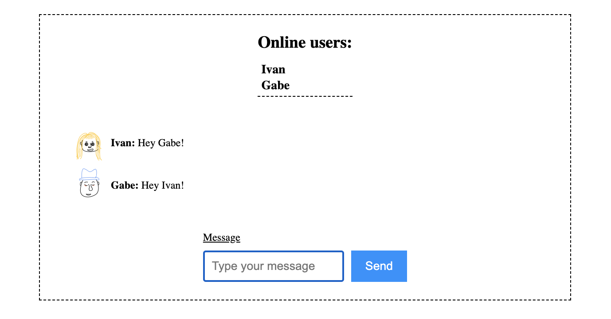

# Deno Chat

Just experimenting on WebSockets using Deno. The `main` branch describes a
high-level implementation using
[Oak middleware framework](https://deno.land/x/oak@v12.4.0), while the
`std-http` branch uses
[Deno's standard library HTTP module](https://deno.land/std@0.186.0/http/mod.ts)
which is more like a middle-level implementation.



# Run locally

```
git clone https://github.com/ivanatias/deno-chat.git

deno task start
```
